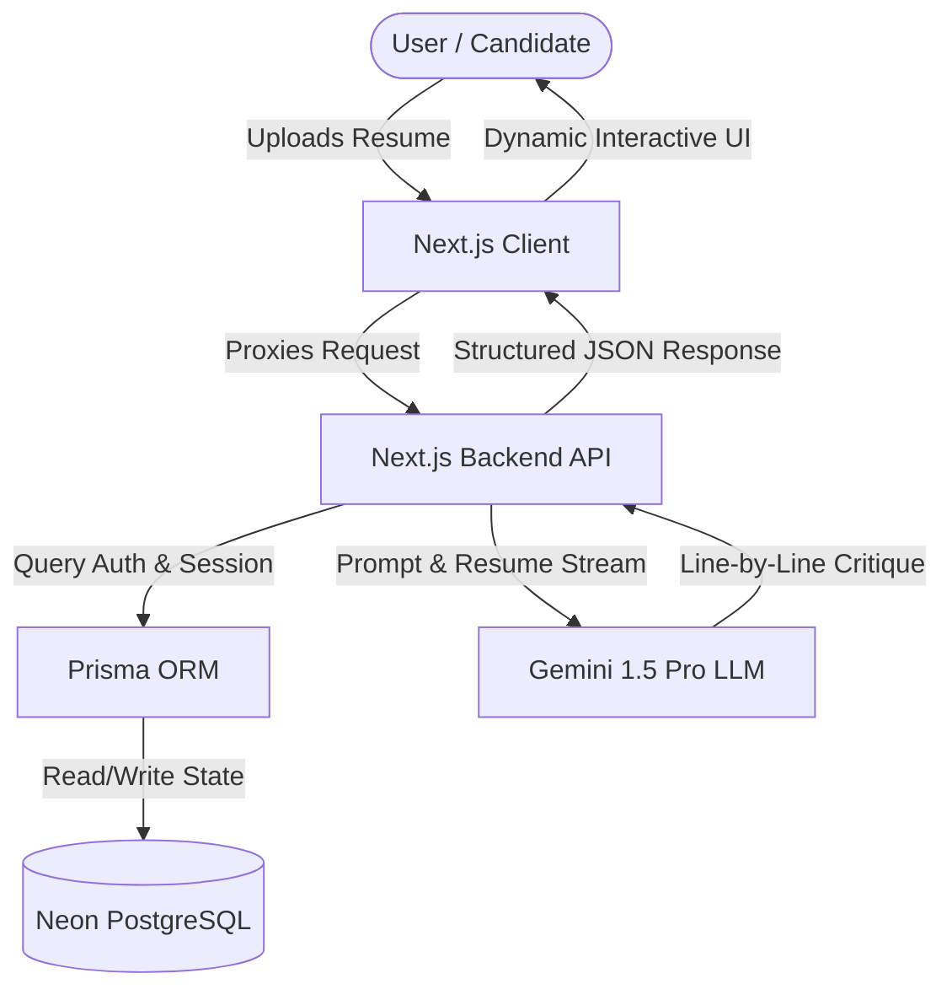
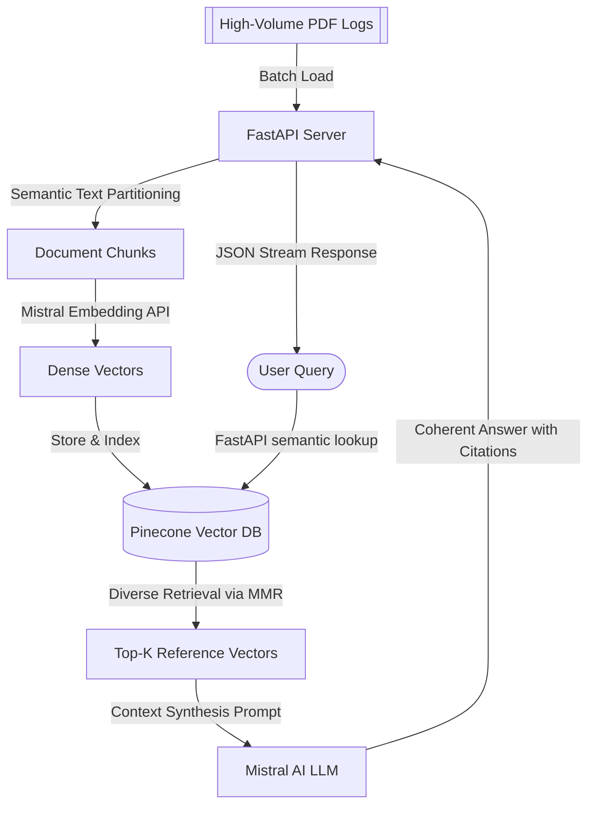

# 🚀 Deepak Kumar

  <h3>Software Development Engineer (SDE)</h3>
  
<b>National Institute of Technology (NIT), Trichy | SDE @ DailyKaam</b>

---

## About Me

I am a Software Development Engineer (SDE) at DailyKaam and a Computer Science & Engineering student at NIT Trichy. I focus on backend API design, distributed database architectures, cloud deployments, and integrating Generative AI pipelines. My engineering philosophy revolves around writing clean, testable code, optimizing execution performance, and building systems that scale efficiently under production loads.

---

## Professional Experience

### Software Development Engineer | DailyKaam *(Current)*
* **Production Web Application Development:** Architect client-facing modules using React and Next.js, reducing rendering latencies and improving load times.
* **Mobile Application Development:** Build and maintain cross-platform mobile app configurations to ensure UI parity and performance.
* **Backend API Engineering:** Design, implement, and optimize RESTful backend API routes in Node.js and Express to manage high-volume data streams.
* **Database Design & Optimization:** Model relational and non-relational database schemas in PostgreSQL and MongoDB, implementing indexing and normalized layouts to reduce lookup latency.
* **Deployment & Production Support:** Maintain Docker runtimes, configure continuous integration scripts, and support live production rollouts.
* **System Scalability & Performance Optimization:** Audit and resolve bottleneck routes to ensure low network latency and maximum request throughput.

### Full Stack Intern | National Institute of Technology (NIT), Trichy *(Jul 2024 – Aug 2024)*
* **High-Throughput Scale:** Architected a MERN-based M-Commerce platform ([Live Application](https://eshop-firebase.vercel.app/)) with Progressive Web App (PWA) support, scaling container workloads on AWS to support 10,000+ concurrent users.
* **Caching & Database Tuning:** Implemented Redis key-value caching, relational index strategies, and collection sharding, resulting in a 35% query performance improvement and a 40% reduction in server CPU load.
* **Automation Pipelines:** Structured automated unit testing and build verification pipelines using GitHub Actions, cutting staging release cycles by 40%.

### Generative AI Intern | Nelumbus Technologies LLP *(Jun 2025 – Jul 2025)*
* **Workflow Acceleration:** Configured LangChain agentic state-machines and multi-model routing loops, boosting administrative operational efficiency by 25%.
* **RAG System Engineering:** Designed and implemented Retrieval-Augmented Generation (RAG) pipelines ([Live Platform](https://rag-document-qna-system.vercel.app/)) using vector embeddings, Pinecone indices, and semantic search, raising output accuracy by 18%.
* **Development Velocity:** Created prompt orchestration helpers that shortened overall developer iteration cycles by 30%.

---

## Featured Projects

### DDR AI Career Coach
* **Business Impact:** Automates candidate resume analysis, yielding parsed scores and line-by-line feedback in under 3 seconds.
* **Technical Challenges:** Mitigating prompt instruction drifts and handling large-context resume documents under rate limits.
* **Architecture:** Next.js client routes requests to serverless API handlers. Sessions are tracked via Prisma ORM to Neon PostgreSQL, while resume uploads are audited via Gemini API.
* **Tech Stack:** Next.js, TypeScript, Gemini API, Prisma ORM, Neon PostgreSQL, TailwindCSS.
* **Repository Link:** [DEEPAK-317/DDRAI-CAREER-COACH](https://github.com/DEEPAK-317/DDRAI-CAREER-COACH)
* **Architecture Flow:**

### RAG-based Document Intelligence System
* **Business Impact:** Powers context-aware query processing over massive PDF log archives, returning precise reference citations.
* **Technical Challenges:** Managing overlap chunk boundaries to maintain semantic intent during document partitioning.
* **Architecture:** FastAPI server coordinates document parsing, Mistral vector embed indexing, and similarity searches inside Pinecone using MMR retrieval patterns.
* **Tech Stack:** Python, FastAPI, LangChain, Pinecone Vector DB, Mistral API.
* **Links:** [Repository](https://github.com/DEEPAK-317/RAG_Document_QnA-_System) | [Live Demo](https://rag-document-qna-system.vercel.app/)
* **Architecture Flow:**

### Explainable Fraud Detection System
* **Business Impact:** Increases audit transparency by generating local explanation weights for transactions flagged as fraudulent.
* **Technical Challenges:** Balancing high anomaly recall targets while preventing false-positive classification inflation.
* **Architecture:** Modular machine learning pipeline (Isolation Forest & Random Forest) feeding prediction scores and explanation weights (SHAP) directly to a Streamlit browser dashboard.
* **Tech Stack:** Python, Streamlit, Scikit-Learn, SHAP, Pandas.
* **Repository Link:** [DEEPAK-317/explainable-fraud-detection](https://github.com/DEEPAK-317/explainable-fraud-detection)

### MailMate AI Email Assistant
* **Business Impact:** Automates dynamic email writing with customizable tone categories, speeding up corporate communication flows.
* **Technical Challenges:** Parsing and validating user inputs into clean prompt formatting constraints.
* **Architecture:** Streamlit frontend routing payloads to python handler methods interfacing with Google Gemini completions.
* **Tech Stack:** Python, Streamlit, Gemini API, Prompt Engineering.
* **Repository Link:** [DEEPAK-317/MailMate](https://github.com/DEEPAK-317/MailMate)

### NITT Student Track System
* **Business Impact:** Streamlines scheduling, daily logging, and assignment management for student workflows.
* **Technical Challenges:** Ensuring session persistence and role validation checks.
* **Architecture:** Single-page client communicating with Node.js controllers, querying data via Mongoose to MongoDB.
* **Tech Stack:** JavaScript, Node.js, Express, MongoDB.
* **Repository Link:** [DEEPAK-317/Nitt-Student-Track](https://github.com/DEEPAK-317/Nitt-Student-Track)

### Split Expense sharing Mobile App
* **Business Impact:** Simplifies ledger tracking and group balances calculation for shared group expenditures.
* **Technical Challenges:** Designing logic models to process offline transactions and state synchronization.
* **Architecture:** Cross-platform React Native views pushing updates to Node.js backend endpoints feeding a MongoDB database.
* **Tech Stack:** TypeScript, React Native, Node.js, Express, MongoDB.
* **Repository Link:** [DEEPAK-317/Split-App](https://github.com/DEEPAK-317/Split-App) (Client) | [DEEPAK-317/SplitApp](https://github.com/DEEPAK-317/SplitApp) (API)

---

## Technical Skills

| Skill Category | Technologies & Tools |
| :--- | :--- |
| **Languages** | Python, JavaScript, TypeScript, C++, C, SQL, Dart |
| **Frontend/Mobile** | Next.js, React.js, React Native, Flutter, Tailwind CSS, HTML5, CSS3 |
| **Backend/Databases** | Node.js, Express.js, FastAPI, PostgreSQL, MongoDB, Redis, Prisma ORM, Firebase |
| **AI/ML/Cloud** | LangChain, Pinecone Vector DB, Gemini API, Mistral API, Docker, AWS |

---

## Open Source

I contribute to developer utilities and runtime wrappers in the Generative AI and web framework spaces:
* **[LangChain Ecosystem](https://github.com/langchain-ai/langchain):** Refactored text loading utilities to minimize runtime buffering delays.
* **[Streamlit Contribs](https://github.com/streamlit/streamlit):** Optimized dashboard rendering modules for consistent responsive displays.
* **[rag-cache-optimizer](https://github.com/DEEPAK-317/rag-cache-optimizer):** *[Active Project]* Building a Python utility for semantic caching of prompt embeddings to reduce LLM latency.

---

## DSA & Problem Solving
* **LeetCode Profile:** [@deepak_3621](https://www.leetcode.com/u/deepak_3621)
* **Statistics:** 400+ algorithmic problems solved across Arrays, Dynamic Programming, Graphs, and Trees.
* **Competitions:** Active participant in weekly optimization rounds to test runtime complexities.

---

## Certifications
* **AWS Certified Cloud Practitioner** - Amazon Web Services
* **Google Cloud Associate Cloud Engineer** - Google Cloud
* **Deep Learning Specialization** - DeepLearning.AI
* **Generative AI with Large Language Models** - DeepLearning.AI / AWS

---

## GitHub Analytics

  
  &nbsp;&nbsp;
  

 

  

---

## Contact Information
* **LinkedIn:** [linkedin.com/in/deepak-kumar-62a4b8270](https://linkedin.com/in/deepak-kumar-62a4b8270)
* **Portfolio:** [deepakkumarnittrichy2026.netlify.app](https://deepakkumarnittrichy2026.netlify.app/)
* **Email:** [deepaknittrichy@gmail.com](mailto:deepaknittrichy@gmail.com)
